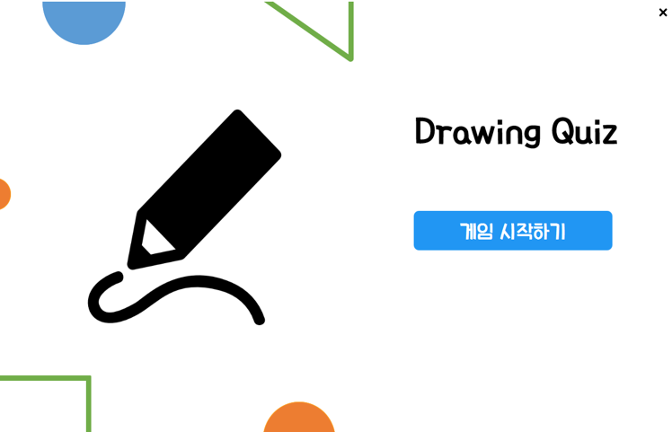
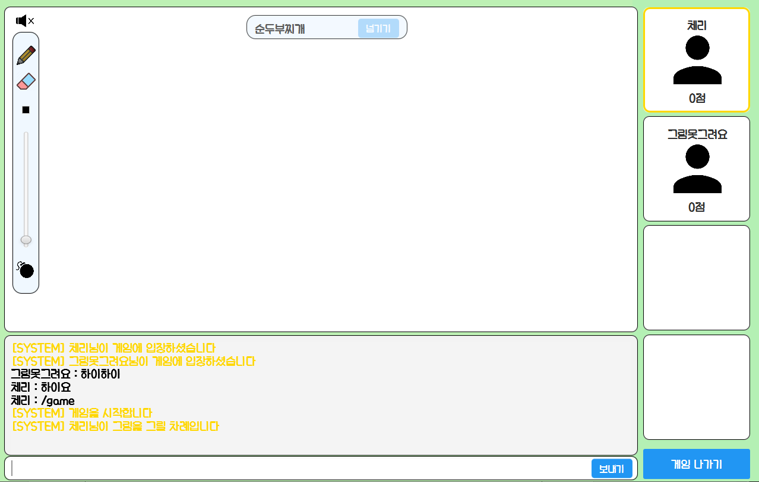
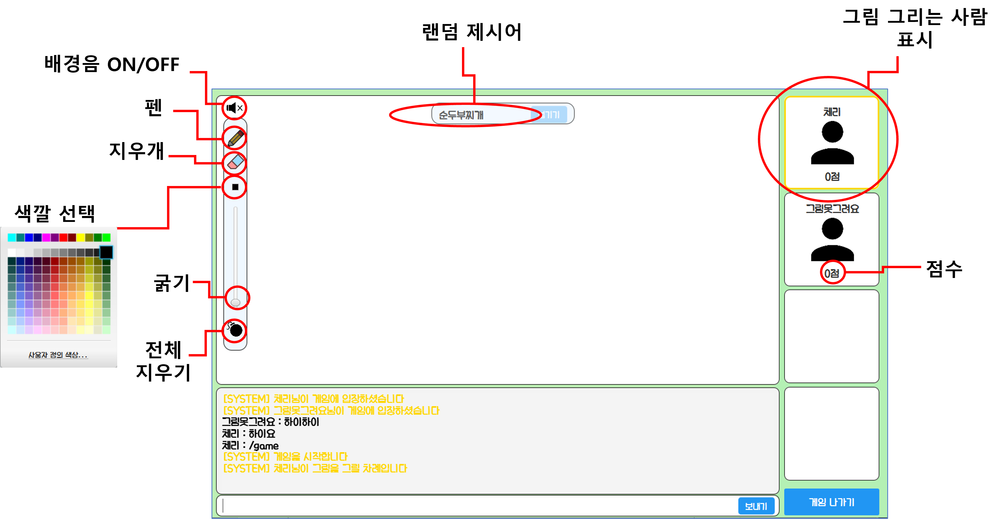

# Java 스케치 퀴즈 프로젝트 (2022.11)
프로젝트 명: Drawing Quiz

개발 인원: 4명

## 실행 화면
### 로그인 -> 게임시작

### 게임 입장
- /game 명령어 입력 시 게임 시작

### 게임 화면

- 자세한 과정은 하단의 영상을 참고할 것

## 기술스택
- Java, Sockets
- Java FX, SceneBuilder
- MariaDB

## 시연 영상
- 영상이 안 보인다면 [여기로](./image/드로잉퀴즈_플레이%20영상.mp4)

